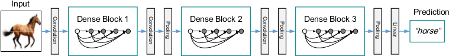
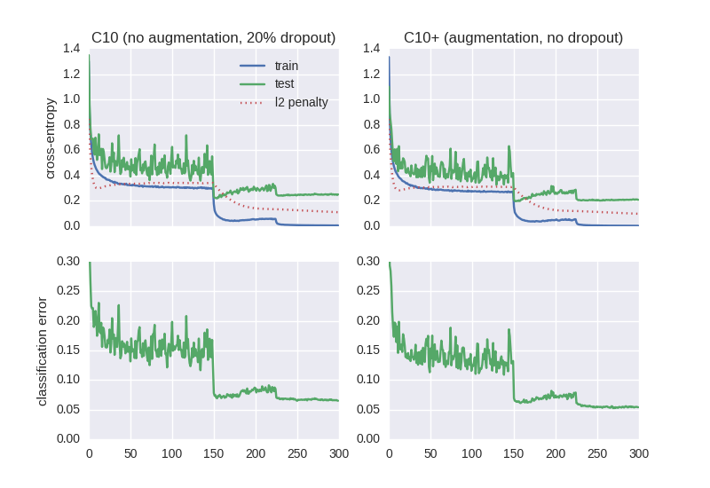

# Densely Connected Convolutional Network (DenseNet) in Lasagne

This is a reimplementation of
Gao Huang et al. (2016),
[Densely Connected Convolutional Networks](http://arxiv.org/abs/1608.06993)
for the [Lasagne](https://github.com/Lasagne/Lasagne) library,
done by [Jan Schlüter (@f0k)](https://github.com/f0k).

## Background
The DenseNet is an extension of the [ResNet](https://arxiv.org/abs/1603.05027):
Instead of adding a convolutional layer's output to its input, it is appended.
This can be seen as creating shortcut connections to all previous layers,
instead of bypassing a single layer only:


This is not done across the full network, but within so-called *dense blocks*:
A set of layers that share the same spatial dimensionality. Between these
blocks, a projection (1x1 convolution) and downsampling (2x2 avg-pooling) are
inserted:



By varying the number of dense blocks, the number of layers per dense block,
or the number of feature maps added by each layer in a dense block (the
*growth rate*), the network architecture can be scaled to different sizes.

## Usage
To reproduce the results of Table 1, last three rows, for C10 (cifar-10 without
data augmentation, with 20% dropout) and C10+ (cifar-10 with random translation
and flipping, without dropout), run:

```bash
./train_test.py -L=40 -k=12 --no-augment --dropout=.2 --save-weights=C10_L40k12.npz
./train_test.py -L=40 -k=12 --augment --dropout=0 --save-weights=C10p_L40k12.npz

./train_test.py -L=100 -k=12 --no-augment --dropout=.2 --save-weights=C10_L100k12.npz
./train_test.py -L=100 -k=12 --augment --dropout=0 --save-weights=C10p_L100k12.npz

./train_test.py -L=100 -k=24 --no-augment --dropout=.2 --save-weights=C10_L100k24.npz
./train_test.py -L=100 -k=24 --augment --dropout=0 --save-weights=C10p_L100k24.npz
```
To keep 5000 training examples for validation and compute the validation loss
and error after each epoch, add `--validate` to the commands. To instead
constantly monitor loss and error on the test set, add `--validate-test`. To
save the loss and error history, add `--save-errors` and a `.npz` file name
(the order is: training loss, L2 loss, validation loss, validation error).

## Results
For the 40-layer network, I got 6.5% test error on C10 and 5.4% on C10+,
compared to 7% and 5.24% in the paper. Training history:



## Implementation Details
The [original implementation by the authors of the paper](https://github.com/liuzhuang13/DenseNet)
is done in Torch. This Lasagne implementation is based on the Torch
implementation, with minor differences:

1. By default, it uses a faster formulation of the model that splits up batch
   normalization and learned scales / shifts to avoid redundant computation.
   The more traditional formulation is included as well (see `densenet.py` and
   `densenet_fast.py`).
2. Initial weights are sampled from a Gaussian distribution with a standard
   deviation of `sqrt(2/fan_in)` for hidden layers, and `sqrt(1/fan_in)` for
   the output layer, following [He et al](https://arxiv.org/abs/1502.01852).
   The authors' implementation uses `sqrt(2/fan_out)` for the hidden, and a
   Uniform distribution in range `+- sqrt(1/fan_in)` for the output layer. For
   reference, the authors' scheme is included at the end of `densenet.py`. It
   does not seem to make a difference at least for the 40-layer networks.
3. While the authors meant to use an L2 decay of 1e-4, the
   [implementation in Torch](https://github.com/torch/optim/blob/63994c7/sgd.lua#L48)
   amounts to a decay of 5e-5 in most other frameworks. I tried both, and 1e-4
   seemed to work better at least for the 40-layer networks.

Everything else (architecture, training scheme, data preprocessing and
augmentation) should be exactly the same.
