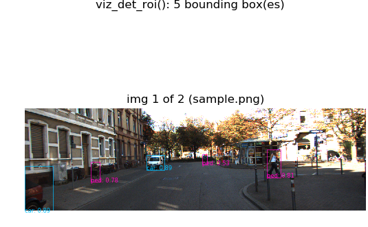
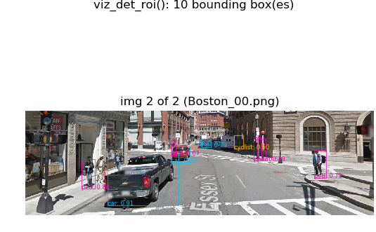
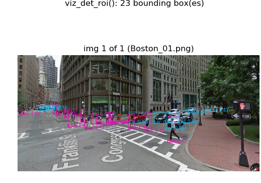

# SqueezeDet_Theano

This is a reimplementation of Bichen Wu's SqueezeDet [1],[2] for
Theano [3] and Lasagne [4] by
[@corvidim](https://github.com/corvidim). The version contained in
this repo corresponds to a snapshot of
[squeezedet_theano](https://github.com/corvidim/squeezedet_theano)
0.1.0.

SqueezeDet is particularly well-suited to low-power,
low-memory-consumption applications. In particular, the trained
weights take up less than 8Mb!

This release includes:

* Network weights trained on the KITTI dataset (`data/squeezedet_kitti.pkl.gz`, <8MB).

* The detector ("prediction graph" and "interpretation graph"
of the original TensorFlow implementation); training is not yet
supported.


References:

- [1] https://arxiv.org/abs/1612.01051
- [2] https://github.com/BichenWuUCB/squeezeDet
- [3] http://deeplearning.net/software/theano/
- [4] http://lasagne.readthedocs.io/en/latest/

## Setup

Requirements:

- Python 2.7+ (Python 3 experimental support; tested under Python 3.6.3)
- Theano 0.9+
- Lasagne 0.2+
- Numpy, PIL, Matplotlib

Sample docker files for Ubuntu installation:

- `./setup/sqzdet_theano_dockerfile.txt` (Python 2, Theano 0.10)
- `./setup/sqzdet_theano_0.9_dockerfile.txt` (Python 2, Theano 0.9)
- `./setup/sqzdet_theano_py3k_dockerfile.txt` (Python 3, Theano 0.10)


To run detection on a default image (`data/sample.png` from the original SqueezeDet demo):

```
THEANO_FLAGS='floatX=float32' python src/sqz_det_thn.py --network_weights=data/squeezedet_kitti.pkl.gz
```

Use the `--img_in` flag to specify an image file, for example:

```
THEANO_FLAGS='floatX=float32' python src/sqz_det_thn.py --network_weights=data/squeezedet_kitti.pkl.gz --img_in=data/Boston_01.png
```

or specify a comma-separated list of images (all of which must be the same size), for example:

```
THEANO_FLAGS='floatX=float32' python src/sqz_det_thn.py --network_weights=data/squeezedet_kitti.pkl.gz --img_in=data/sample.png,data/Boston_00.png
```

Output visualization(s) will be saved in PDF format to the current
directory (e.g., `./out_sample.pdf`) and displayed (if running
interactively) as shown below.  To specify a different directory for
output use the `--out_dir` flag.

## Output visualizations of sample input images
---


---



---



---

